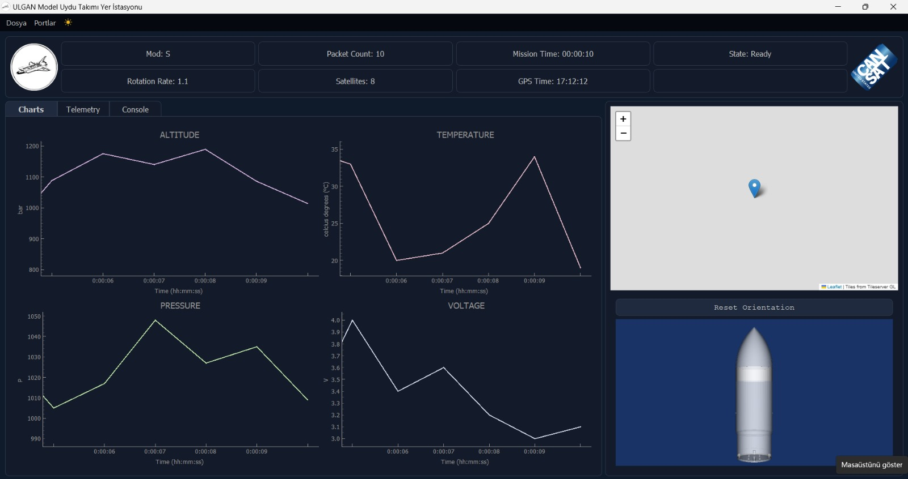

# Python Programlama Dili Temelleri

Python, okunabilirliği ve kullanım kolaylığı ile öne çıkan, genel amaçlı bir programlama dilidir. İşte Python öğrenmek isteyen birinin bilmesi gereken temel konular:

## 1. Kurulum ve Ortam

- Python'un [resmi web sitesinden](https://www.python.org/) indirme ve kurulum
- IDE (PyCharm, VS Code) veya metin editörleri kullanımı
- Terminal/Komut satırı ile Python kullanımı

## 2. Temel Sözdizimi (Syntax)

```python
# Bu bir yorum satırıdır
print("Merhaba Dünya!")  # Ekrana çıktı yazdırma
```

## 3. Değişkenler ve Veri Tipleri

```python
# Değişken tanımlama
isim = "Ahmet"  # String (metin)
yas = 25  # Integer (tam sayı)
boy = 1.78  # Float (ondalıklı sayı)
ogrenci_mi = True  # Boolean (mantıksal değer)

# Tip dönüşümleri
str_yas = str(yas)  # Sayıdan metine dönüşüm
```

## 4. Temel Veri Yapıları

```python
# Liste (değiştirilebilir, sıralı koleksiyon)
meyveler = ["elma", "armut", "muz"]
meyveler.append("çilek")  # Listeye eleman ekleme

# Tuple (değiştirilemez, sıralı koleksiyon)
koordinatlar = (40.98, 29.02)

# Sözlük (anahtar-değer çiftleri)
kisi = {"isim": "Ayşe", "yas": 30, "meslek": "Mühendis"}

# Küme (benzersiz elemanlar)
renkler = {"kırmızı", "mavi", "yeşil"}
```

## 5. Operatörler

```python
# Aritmetik operatörler
toplam = 5 + 3
fark = 10 - 4
carpim = 6 * 3
bolum = 15 / 5
kalan = 7 % 2
us = 2 ** 3  # 2 üzeri 3

# Karşılaştırma operatörleri
esit_mi = (5 == 5)  # True
buyuk_mu = (10 > 5)  # True

# Mantıksal operatörler
sonuc = (5 > 3) and (10 < 20)  # True
```

## 6. Koşullu İfadeler

```python
yas = 18

if yas < 13:
    print("Çocuk")
elif yas < 18:
    print("Genç")
else:
    print("Yetişkin")
```

## 7. Döngüler

```python
# For döngüsü
for i in range(5):  # 0'dan 4'e kadar
    print(i)

# Liste üzerinde döngü
meyveler = ["elma", "armut", "muz"]
for meyve in meyveler:
    print(meyve)

# While döngüsü
sayac = 0
while sayac < 5:
    print(sayac)
    sayac += 1
```

## 8. Fonksiyonlar

```python
# Fonksiyon tanımlama
def selamla(isim):
    return f"Merhaba, {isim}!"

# Fonksiyon çağırma
mesaj = selamla("Ayşe")
print(mesaj)

# Varsayılan parametre
def topla(a, b=0):
    return a + b

sonuc = topla(5)  # 5 + 0 = 5
```

## 9. Modüller ve Kütüphaneler

```python
# Standart kütüphane modülleri
import math
kok = math.sqrt(16)  # 4.0

from datetime import datetime
simdi = datetime.now()

# Harici kütüphaneleri kullanma (önce pip ile kurulum gerekir)
# pip install numpy
import numpy as np
dizi = np.array([1, 2, 3])
```

## 10. Hata Yönetimi

```python
try:
    sayi = int(input("Bir sayı girin: "))
    sonuc = 10 / sayi
    print(f"Sonuç: {sonuc}")
except ValueError:
    print("Geçerli bir sayı girmediniz!")
except ZeroDivisionError:
    print("Sıfıra bölme hatası!")
finally:
    print("İşlem tamamlandı.")
```

## 11. Dosya İşlemleri

```python
# Dosya yazma
with open("veriler.txt", "w", encoding="utf-8") as dosya:
    dosya.write("Merhaba, dünya!")

# Dosya okuma
with open("veriler.txt", "r", encoding="utf-8") as dosya:
    icerik = dosya.read()
    print(icerik)
```

## 12. Nesne Yönelimli Programlama (OOP)

```python
class Ogrenci:
    def __init__(self, isim, numara):
        self.isim = isim
        self.numara = numara
        self.notlar = []

    def not_ekle(self, not_degeri):
        self.notlar.append(not_degeri)

    def ortalama_hesapla(self):
        if not self.notlar:
            return 0
        return sum(self.notlar) / len(self.notlar)

# Nesne oluşturma ve kullanma
ali = Ogrenci("Ali", 101)
ali.not_ekle(85)
ali.not_ekle(90)
print(f"Ortalama: {ali.ortalama_hesapla()}")
```

## 13. Lambda Fonksiyonları

```python
# Lambda (anonim) fonksiyon
kare_al = lambda x: x ** 2
print(kare_al(5))  # 25

# Map fonksiyonu ile kullanım
sayilar = [1, 2, 3, 4, 5]
kareler = list(map(lambda x: x ** 2, sayilar))
print(kareler)  # [1, 4, 9, 16, 25]
```

## Öğrenme Kaynakları

1. [Python Resmi Belgeleri](https://docs.python.org/tr/)
2. Çevrimiçi kurslar (Udemy, Coursera, edX)
3. Python için kitaplar (örn. "Python Crash Course")
4. Pratik yapabileceğiniz platform ve uygulamalar (HackerRank, LeetCode, Codecademy)

## İlerleyiş Önerileri

1. Temel kavramları öğrendikten sonra küçük projeler geliştirin
2. Kod incelemeleri yapın ve feedback alın

## PyQt ile Arayüz Geliştirme

PyQt, Python programlama dili için Qt uygulama geliştirme çerçevesinin bağlantısıdır. Masaüstü uygulamaları geliştirmek için kullanılan güçlü bir araçtır.

### PyQt Kurulumu

```python
# PyQt5'in kurulumu
pip install PyQt5
```

### Temel Pencere Oluşturma

```python
import sys
from PyQt5.QtWidgets import QApplication, QMainWindow, QLabel

# Uygulama oluşturma
app = QApplication(sys.argv)

# Ana pencere oluşturma
pencere = QMainWindow()
pencere.setWindowTitle("İlk PyQt Uygulamam")
pencere.setGeometry(100, 100, 400, 300)  # x, y, genişlik, yükseklik

# Etiket ekleme
etiket = QLabel("Merhaba PyQt!", pencere)
etiket.move(150, 100)

# Pencereyi gösterme
pencere.show()

# Uygulamayı çalıştırma
sys.exit(app.exec_())
```

### Temel Widget'lar

```python
from PyQt5.QtWidgets import (QApplication, QMainWindow, QLabel,
                            QPushButton, QLineEdit, QComboBox)

# Düğme oluşturma
dugme = QPushButton("Tıkla", pencere)
dugme.move(150, 150)
dugme.clicked.connect(bir_fonksiyon)  # Sinyal-yuva bağlantısı

# Metin kutusu
metin_kutusu = QLineEdit(pencere)
metin_kutusu.move(150, 200)

# Açılır liste
liste = QComboBox(pencere)
liste.addItems(["Seçenek 1", "Seçenek 2", "Seçenek 3"])
liste.move(150, 250)
```

### Yerleşim Yöneticileri

```python
from PyQt5.QtWidgets import QVBoxLayout, QHBoxLayout, QWidget

# Dikey yerleşim
widget = QWidget()
dikey_yerlesim = QVBoxLayout()
dikey_yerlesim.addWidget(etiket)
dikey_yerlesim.addWidget(dugme)
dikey_yerlesim.addWidget(metin_kutusu)
widget.setLayout(dikey_yerlesim)

# Yatay yerleşim
yatay_yerlesim = QHBoxLayout()
yatay_yerlesim.addWidget(etiket)
yatay_yerlesim.addWidget(dugme)
```

### Sinyal ve Yuvalar

```python
def dugme_tiklandi():
    etiket.setText("Düğmeye tıklandı!")

dugme.clicked.connect(dugme_tiklandi)  # Sinyali fonksiyona bağlama
```

### Diyalog Pencereleri

```python
from PyQt5.QtWidgets import QMessageBox

def mesaj_goster():
    QMessageBox.information(pencere, "Bilgi", "Bu bir bilgi mesajıdır.")

# Farklı diyalog türleri
# QMessageBox.warning()
# QMessageBox.critical()
# QMessageBox.question()
```

### Menü ve Araç Çubukları

```python
from PyQt5.QtWidgets import QAction, QMenu

# Menü çubuğu oluşturma
menu_bar = pencere.menuBar()
dosya_menu = menu_bar.addMenu("Dosya")

# Eylem oluşturma
yeni_eylem = QAction("Yeni", pencere)
yeni_eylem.setShortcut("Ctrl+N")
yeni_eylem.triggered.connect(yeni_dosya_fonksiyonu)

# Eylemi menüye ekleme
dosya_menu.addAction(yeni_eylem)
```

### Veri Görselleştirme ve Grafikler

```python
from PyQt5.QtChart import QChart, QChartView, QLineSeries
from PyQt5.QtCore import Qt

# Veri serisi oluşturma
seri = QLineSeries()
seri.append(0, 1)
seri.append(1, 3)
seri.append(2, 5)
seri.append(3, 2)
seri.append(4, 6)

# Grafik oluşturma
grafik = QChart()
grafik.addSeries(seri)
grafik.createDefaultAxes()
grafik.setTitle("Örnek Çizgi Grafiği")

# Grafik görünümü oluşturma
grafik_gorunumu = QChartView(grafik)
grafik_gorunumu.setRenderHint(QPainter.Antialiasing)
```

### Stil ve Tema

```python
from PyQt5.QtWidgets import QApplication

# Uygulama stilini ayarlama
app.setStyle("Fusion")

# Özel stil sayfası (CSS benzeri)
style_sheet = """
    QPushButton {
        background-color: #4CAF50;
        color: white;
        border-radius: 5px;
        padding: 5px;
    }
    QPushButton:hover {
        background-color: #45a049;
    }
"""
app.setStyleSheet(style_sheet)
```

### PyQt ile Çoklu İş Parçacığı (Threading)

```python
from PyQt5.QtCore import QThread, pyqtSignal

class IslemThread(QThread):
    # Sinyal tanımlama
    islem_bitti = pyqtSignal(str)

    def run(self):
        # Uzun süren işlem
        import time
        time.sleep(5)
        # İşlem bittiğinde sinyal gönderme
        self.islem_bitti.emit("İşlem tamamlandı!")

# Thread'i kullanma
def uzun_islem_baslat():
    thread = IslemThread()
    thread.islem_bitti.connect(lambda mesaj: etiket.setText(mesaj))
    thread.start()
```

## PyQt Öğrenme Kaynakları

1. [PyQt5 Resmi Belgeleri](https://www.riverbankcomputing.com/static/Docs/PyQt5/)
2. [Qt for Python Belgeleri](https://doc.qt.io/qtforpython/)
3. Çevrimiçi eğitimler ve videolar

## PyQt İlerleyiş Önerileri

1. Basit bir hesap makinesi uygulaması geliştirin
2. Verileri grafiklerle görselleştiren bir program yapın
3. Sensör verilerini gerçek zamanlı görüntüleyen bir arayüz tasarlayın
4. Bir veritabanı yönetim arayüzü oluşturun

## PyQt ile Yer İstasyonu Projesi

Yer istasyonu projesi, CanSat (veya başka bir uçan platform) ile yer istasyonu arasındaki iletişimi sağlayan bir arayüz oluşturmayı amaçlar. Bu proje, PyQt kullanarak gerçek zamanlı veri görselleştirme ve izleme yeteneklerini uygulamanızı sağlar.


### Proje Gereksinimleri

1. **PyQt ile Arayüz Tasarımı**

   - PyQt5 veya PyQt6 kullanarak modern bir yer istasyonu arayüzü oluşturulacak
   - Arayüz, sensör verilerini görselleştirmek için grafikler içerecek
   - Uçuş durumu ve telemetri bilgileri için ayrı paneller bulunacak

2. **Veri Görselleştirme**

   - `telemetry_data.csv` dosyasındaki veriler arayüzde gösterilecek
   - TEAM_ID, MODE ve STATE bilgileri metin olarak görüntülenecek
   - TEMPERATURE, ALTITUDE, PRESSURE ve VOLTAGE değerleri gerçek zamanlı grafiklerle görselleştirilecek
   - Grafikler, yeni veriler geldikçe otomatik olarak güncellenecek

3. **Gerçek Zamanlı Veri İşleme**

   - CSV dosyasındaki her bir satır 1 saniye aralıkla okunacak
   - Okunan veriler anlık olarak arayüzdeki tüm göstergelerde güncellenecek
   - Veri akışı simülasyonu için bir zamanlayıcı (QTimer) kullanılacak

4. **Responsive Tasarım**
   - Arayüz, farklı ekran boyutlarına uyum sağlayacak şekilde tasarlanacak
   - QGridLayout, QVBoxLayout ve QHBoxLayout gibi yerleşim yöneticileri kullanılacak
   - Pencere boyutu değiştirildiğinde bileşenler uygun şekilde yeniden boyutlandırılacak


### Proje Değerlendirme Kriterleri

1. Kod organizasyonu ve yapısı
2. Veri görselleştirme kalitesi
3. Gerçek zamanlı veri işleme doğruluğu
4. Arayüz tasarımı ve kullanıcı deneyimi
5. Responsive tasarım uygulaması
6. Özel özellikler ve geliştirmeler

### İleri Seviye Geliştirmeler

- Harita entegrasyonu (CSV ye GPS verisi eklenerek)
- Uzaktan komut gönderme arayüzü
- QTabWidget kullanılarak Charts ve Table olarak iki tab oluşturulduktan sonra Charts'ta grafikler Table'da gelen CSV'deki veriler bir tabloda listelenebilir

### Örnek Arayüz
